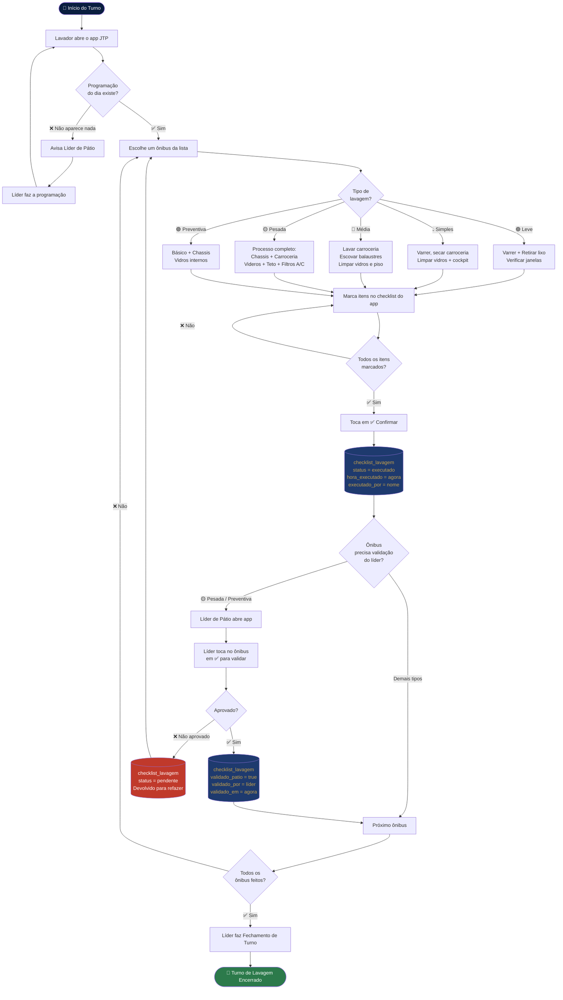

# Fluxograma — Processo de Lavagem

**Processo:** Lavagem de ônibus (turno)  
**Cargos envolvidos:** Lavador, Líder de Pátio  
**Atualizado em:** 21/06/2026

---

## Diagrama de Fluxo

---

## Interações com o Banco de Dados (Supabase)

| Evento | Tabela | Ação | Quem faz |
|--------|--------|------|----------|
| Lavador confirma lavagem | `checklist_lavagem` | UPDATE: status → `executado`, hora_executado, executado_por | Lavador |
| Lavador marca "Não realizado" | `checklist_lavagem` | UPDATE: status → `nao_realizado` | Lavador |
| Lavador desfaz registro | `checklist_lavagem` | UPDATE: status → `pendente`, limpa hora e nome | Lavador |
| Lavagem Leve em lote | `checklist_lavagem` | UPDATE em todos os leves pendentes da garagem do dia | Lavador |
| Líder valida lavagem | `checklist_lavagem` | UPDATE: validado_patio → true, validado_por, validado_em | Líder de Pátio |
| Líder reprova lavagem | `checklist_lavagem` | UPDATE: validado_patio → false, status → pendente | Líder de Pátio |

---

## Pontos de Decisão

| Ponto | Opções | Impacto |
|-------|--------|---------|
| Programação existe? | Sim / Não | Se não, o turno não pode começar — bloqueia o lavador |
| Tipo da lavagem | Leve / Simples / Média / Pesada / Preventiva | Define o checklist e o tempo estimado |
| Todos os itens marcados? | Sim / Não | O botão Confirmar só ativa quando todos estão marcados |
| Ônibus saiu antes de ser lavado? | Sim / Não | Usar "Não realizado" + avisar líder |
| Lavagem pesada aprovada pelo líder? | Sim / Não | Se não, volta para lavador refazer |

---

## Rede de Apoio — Lavagem

| Situação | Quem acionar |
|----------|-------------|
| Sem programação no app | Líder de Pátio |
| Ônibus saiu sem ser lavado | Líder de Pátio → Coordenador |
| App com erro / tela branca | Líder de Pátio |
| Produto de limpeza acabou | Líder de Pátio → Líder de Suprimentos |
| Lavagem pesada reprovada repetidamente | Líder de Pátio avalia / re-treina lavador |
